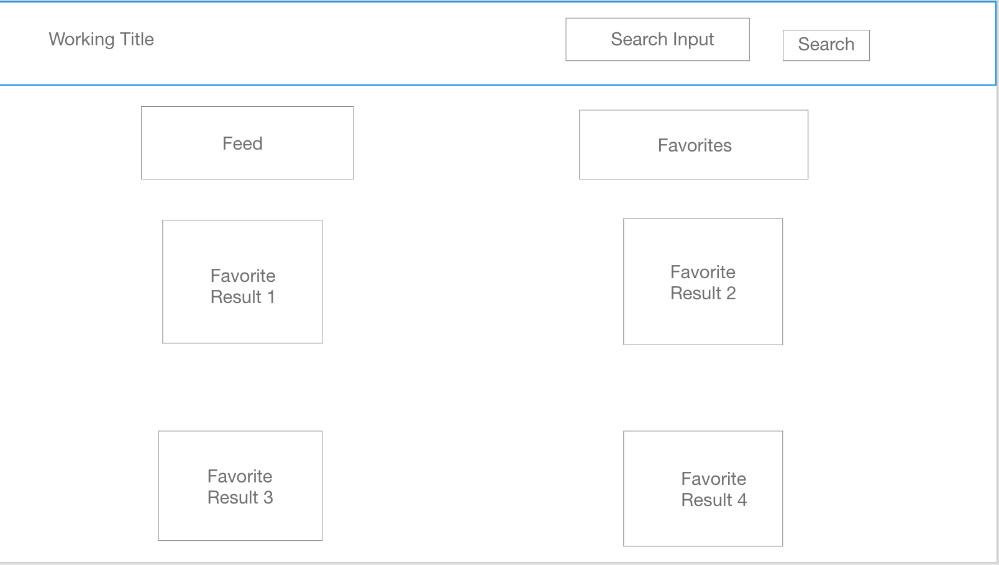

# GiphyNow

##Demo

See live demo [here](http://giphynow.surge.sh/)

##Setup

To run this project locally,
- Click 'Clone or Download' and copy the link to this repository.
- In the terminal navigate to the directory you want to store the project in and clone this repository:
```shell
cd YOUR_DIRECTORY
git clone https://github.com/kofosu2289/giphyNow.git
```
- Navigate to the directory you have just created and install all required node modules
```shell
cd giphyNow
npm install
```
- In your browser, go to the Giphy developers' [homepage](https://developers.giphy.com/) and create an account to receive an API key.

- In the root of your project folder, create a file named .env and store your API key as a variable there.
```
REACT_APP_API_KEY = YOUR_API_KEY
``` 
- In the terminal, ensure you are in the root of your project and start the development server.
```
npm run start
```
## Project Description

GiphyNow is a React web app that allows a user to search for gifs using the Giphy API. The user will also be able to 'favorite' gifs for later viewing.<br><br>

## Wireframes

- Homepage
  
  <br><br>

- Search Results
  
  <br><br>

- Favorites
  
  <br><br>

## Problems Encountered

  At the beginning of development, I Was anticipating CORS/CORB issues. However, the issue I was actually met with occurred when I attempted to implement am infinite scrolling feature for the Home page. The app was making to many GET request to the Giphy API in rapid succession, which would lead to the app crashing. 
  
## Solution
  I was eventually able to figure out how to throttle the API calls by adjusting the code so that the GET requests are only made once the user has scrolled to a certain point on the page

  ```
  class App extends Component {
  constructor() {
    super();
    this.state = {
      isFeed: true,
      searchQuery: "",
      gifs: [],
      searchGifs: [],
      gifsOffset: [],
      favorites: []
    };
  }

  ...

  infiniteScroll = event => {
    if ((window.innerHeight + window.scrollY) < (document.body.offsetHeight - 50))
    return;
    
    this.setState({
      gifsOffset: Number(this.state.gifsOffset) + 25
    });
    this.loadFeed();
  };

  ...

  }
  ```

### MVP

- Find and use external API
- Render data on page
- Use only React for DOM manipulation
- Implement infinite scrolling on home page
- User is able to search for gifs of a specific theme<br><br>

### Post - MVP

- Incorporate memes into the web app
- Create a meme generator
- Allow user to share memes/gifs to social media<br><br>

### Code Snippet

In addition to the fix I implemented to throttle the GET requests made to the Giphy API, I am particularly proud of the code I used to conditionally render different gifs based on if I am searching, viewing the trending feed, or viewing my favorited gifs. I created a key in state called isFeed, which is true when the Feed button is clicked and false when the Search button is clicked. In the component that renders the gifs on the screen, the app checks to see what the value of isFeed is and renders the appropriate gifs.

```
decideDisplay = () => {
    if (this.props.isFeed === true) {
      return (
        this.props.gifs.map((gif) =>
          <figure key={gif.id} className="effect-sarah" onClick={(event) => this.props.action(event, gif.url)}>
            <span>
              
            </span>
            <figcaption>
              <h2><FontAwesomeIcon icon={this.props.icon} /></h2>
            </figcaption>
          </figure>
        )
      );
    } else if(this.props.isFeed === false) {
      return (
        this.props.searchGifs.map((gif) =>
          <figure key={gif.id} className="effect-sarah" onClick={(event) => this.props.action(event, gif.url)}>
            <span>
              
            </span>
            <figcaption>
              <h2><FontAwesomeIcon icon={this.props.icon} /></h2>
            </figcaption>
          </figure>
        )
      );
    } else {
      return (
        this.props.gifs.map((gif) =>
          <figure key={gif.id} className="effect-sarah" onClick={(event) => this.props.action(event, gif)}>
            <span>
              
            </span>
            <figcaption>
              <h2><FontAwesomeIcon  icon={this.props.icon} /><br /><a className='gif-title' href={gif.url}>{gif.title}</a></h2>
            </figcaption>
          </figure>
        )
      );
    }
  }
  ```
  
### Additional Libraries

- [Axios](http://https://www.npmjs.com/package/axios), for making asychronous HTTP requests
- [Font Awesome](https://www.npmjs.com/package/font-awesome) and [React-Bootstrap](https://www.npmjs.com/package/react-bootstrap), for custom styling and icons
